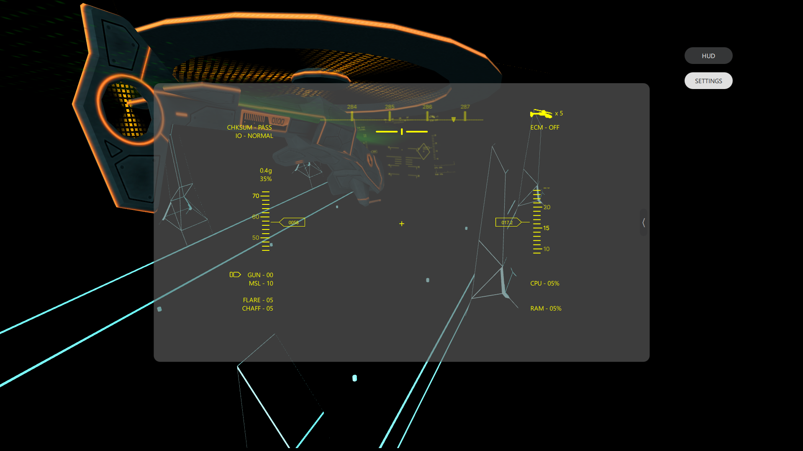
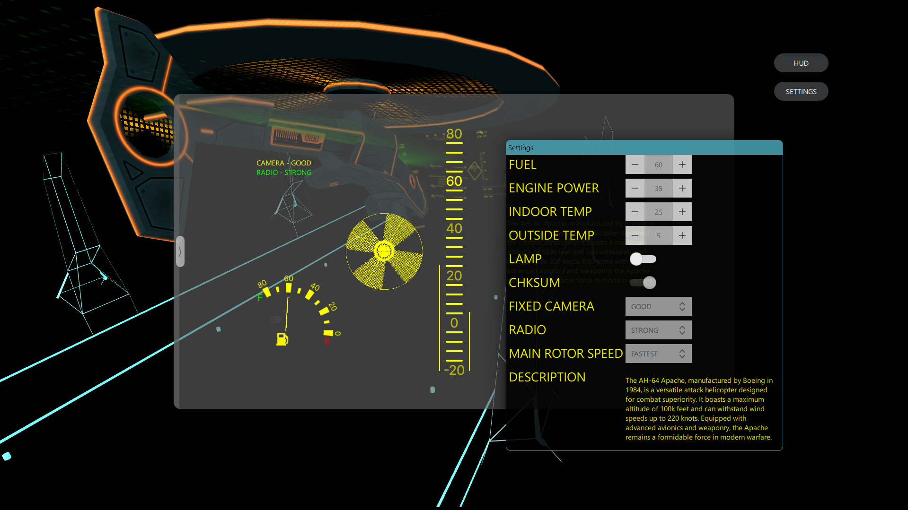
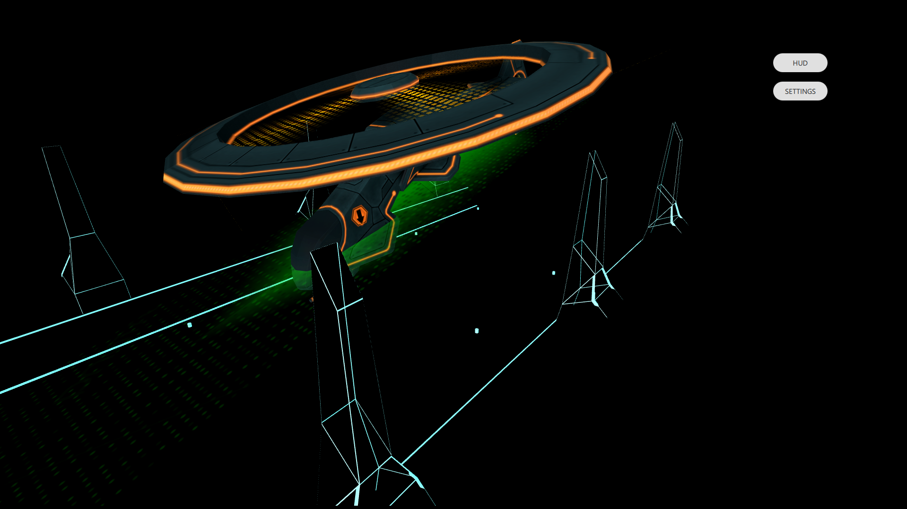

# Helicopter

Helicopter is a software project designed to simulate helicopter flight dynamics and provide a platform for aerial vehicle control.

## Features

- [Realistic flight simulation]
- [Modular architecture]
- [Customizable control systems]

## Screenshots





## Getting Started

### Prerequisites

- Qt 6 for Windows
- Qt3D module
- Qt Multimedia module
- Qt Quick 3D Physics module
- Qt Quick Effect Maker
- Qt Remote Objects module
- Qt Quick Timeline module

Please ensure all required Qt modules are installed and available in your development environment.

### Installation

```sh
git clone https://github.com/moh-skec/Helicopter.git
./Helicopter.exe
```

### Usage

```sh
cd ${Installation Path}
./HelicopterApp.exe
```

## Contributing

Contributions are welcome! Please open issues or submit pull requests for improvements.

## License

This project is licensed under the MIT License. Please watch the [LICENSE](LICENSE) file for details.

## Contact

For questions or support, contact [Shahpoorymohammadhossein@gmail.com](mailto:Shahpoorymohammadhossein@gmail.com).
